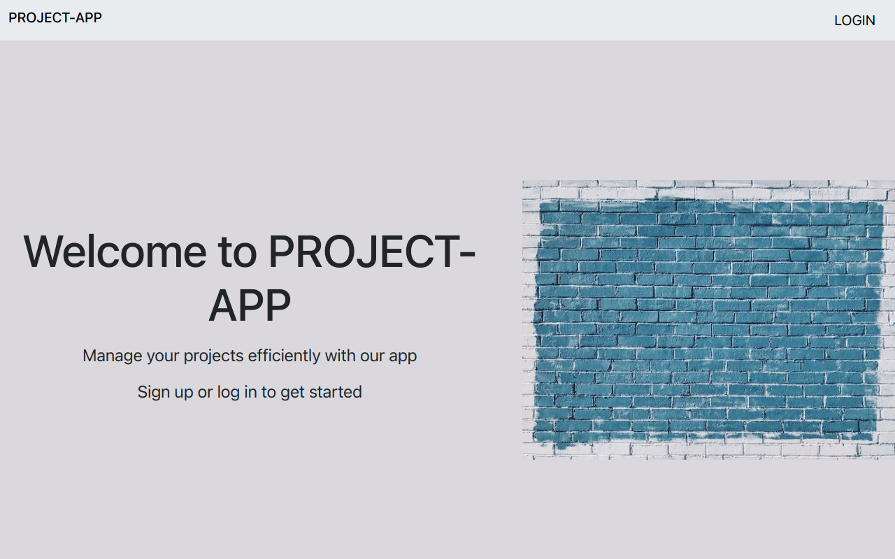

# PROJECT-APP

## Description
This project is a web app named **Project-App**,an application that allows a user to manage projects that they are working on as well as other users they are collaborating with.
This repository is the frontend side of the application. The backend being a Ruby built API that uses Sinatra.
More information on the backend can be found in the following link: [Project-App Back-end](https://github.com/Malcolm-G/project-app-backend). 

### The image below is a screenshot of the landing page.

## Technologies Used
This project was bootstrapped with [Create React App](https://github.com/facebook/create-react-app).
Notable technologies used in this project include:
- [React](https://reactjs.org/)

The application also gets and stores data using an API built with Sinatra.  
The API is made accessible by hosting it using [Render](https://render.com/), a hosting platform. The main API linkisas below:

        https://malcolm-p3-project-app.onrender.com/
        

## Project Setup
### Installation of application
In order for you to use the content on this repo ensure you have the following:

- A computer that runs on either of the following: (Windows 7+, Linux, Mac OS)
- NPM
- 
Installation of the application is not necessary but if one wishes to, the steps are described below.
The installation steps are described for a linux machine.\
To use this repo on your machine requires some simple steps

#### Alternative One (Cloning directly from my repository)
- Open a terminal / command line interface on your computer

- Clone the repo into your folder of choice by using the following:

        git clone https://github.com/Malcolm-G/project-app-frontend.git

- Change directory to the repo folder:

        cd project-app-frontend
- (Optional) Open it in Visual Studio Code

  
        code .
- (Alternate Option) Open it in any editor of your choice.

- Install the relevant dependencies by running the command:

        npm install

#### Alternative Two (Forking to your own repository)
- On the top right corner of this page there is a button labelled **Fork**.

- Click on that button to fork the repo to your own account.

- Take on the process in Alternative One above.

- Remember to use your username when cloning.

        git clone https://github.com/your-username-here/project-app-frontend.git

### Running the application
If you wish to run application from cloned repository:

- In the terminal run the command: `npm start`

If you wish to access the application without cloning it to your computer,simply follow this simple step:
- Access the website by going to the following link:
   
                https://p3-project-app-frontend.vercel.app/

---
## Authors
This project was contributed to by:
- [Malcolm Githuka](https://github.com/Malcolm-G-Moringa)
## License
The project is under GNU GENERAL PUBLIC LICENSE Version 3

